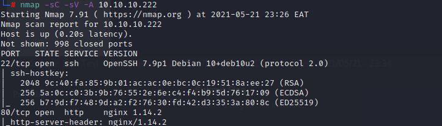
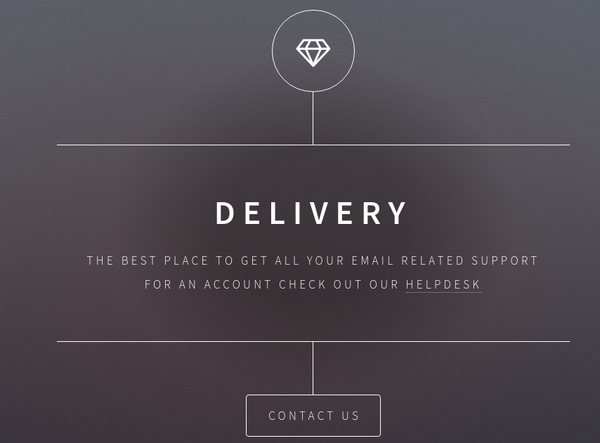

Delivery:

MACHINE IP: 10.10.10.222
MACHINE NAME: Dlivery

nmap scan as usual, open ports as below:
-Port 22 running SSH.
-Port 80 running HTTP.
-Port 8065 running an unknown service.

#Enumeration: Web Site.

Reading the content and viewing the Contact section, there are a few links to other services:

• http://helpdesk.delivery.htb/
• http://delivery.htb:8065/

Since .htb is not a real top level domain, and :8065 was the unknown service that nmap reported, 
it’s safe to assume that these are local to this machine. 
We can edit the /etc/hosts file on our Kali box to tell the web browser that any DNS
resolution of those URLs should point to the IP address of the HTB server.

add to /etc/hosts
10.10.10.222  delivery.htb
10.10.10.222  helpdesk.delivery.htb

We can now go to http://delivery.htb/ and it will display the same landing page as before. Going to the 
other external links, we find two other services running on this box.
• HelpDesk: osTicket Support Ticket System
• MatterMost (the unknown service running on 8065)

MatterMost seems interesting enoug, we'll enumerate this further.

So what exactly is this service? Time to head over to Google.

MatterMost is an open-source, self-hostable online chat service with file sharing, search, and 
integrations. It is designed as an internal chat for organisations and companies, and mostly markets 
itself as an open-source alternative to Slack and Microsoft Teams.

This seems to be a dead end. This is a relatively new software, primarily written in Go. No exploit in exploitdb as of yet.

#Enumeration: Help Desk

The landing page.

>This is powered by osTicket’s Support Ticket System.
>Widely used and open source support ticketing system.
>To interact with this system, we can try opening a ticket.

> On the contact us page;

>So let's create a ticket.
>upon submission, we are presented with an email:

Email: 1168568@delivery.htb

>We are also told how check the ticket status.

There's a feature allowing the customer to reply directly to an email, and it will show up in the Customer 
Service Portal. 

Let’s leverage this , to gain access to the MatterMost service!

Sign up for a new user using the email from the support ticket.

To get the confirmation email, we’ll need to access the support ticket created earlier. 
Going back to the Help Desk, and use the Check Ticket Status option. View the ticket, use the ticket ID 
and the customer email (drt@local.host) to view the data.

Check the page for the confirmation link to MatterMost.

Copy/paste the confirmation URL into the web browser and gain access to the MatterMost instance.

Looking at the thread we see one other user root and some SSH credentials. There’s also a message 
to stop using a common password variation because of how easily it can be exploited. This is a score! Lets 
try and ssh in using the creds.

Creds:
maildeliverer:Youve_G0t_Mail! 

Lets ssh in

And Jackpot! We have the user flag.

An interesting process that I have identified running is mysql db. This makes sense because from the architecture of this 
system, the tickets would need to be stored somewhere.

Let's have a look at the /opt/mattermost/config/config.json that contains config files.

From here we can find the creds in plaintext to gain access to mysql DB.

mmuser:Crack_The_MM_Admin_PW

mysql -u mmuser -D mattermost -p

SELECT username, password FROM Users WHERE username = 'root';

root     | $2a$10$VM6EeymRxJ29r8Wjkr8Dtev0O.1STWb4.4ScG.anuu7v0EFJwgjjO

Remeber this comment from the root user from the forum?

We’re going to use PleaseSubscribe! as our wordlist. Create a new file called wordlist.txt and add PleaseSubscribe! to it. 
We’ll have hashcat do a rule based attack to try and find the password.

we can use hashid to identify the type of hash we are up against.

hashcat -a 0 -m 3200 hash.txt wordlist.txt -r Hob0Rules/d3adhob0.rule -o cracked.txt -w 3 -O

https://github.com/praetorian-inc/Hob0Rules.git

And that's all she wrote. Till the next one!

